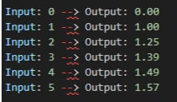

# Coding club

## Summer of Code

Notre objectif est simple : vous immerger dans l'univers des défis de code pour vous familiariser avec la résolution de problèmes algorithmiques et développer vos compétences en programmation de manière ludique et interactive.

Durant cette journée, vous relèverez des défis stimulants et variés qui mettront à l’épreuve votre logique et votre créativité. Que vous soyez débutants ou expérimentés, chaque activité sera une occasion d’apprendre et de vous perfectionner dans une ambiance conviviale et collaborative.

Préparez-vous à coder, à échanger avec d’autres passionnés et à découvrir de nouvelles techniques et astuces pour aborder les problèmes de programmation. Cette journée sera une opportunité d'améliorer vos compétences et de rencontrer des personnes partageant les mêmes centres d’intérêt.

Alors, êtes-vous prêts à relever le défi ?

### Matériel nécessaire

Pour ce faire, vous aurez besoin des éléments suivants :

- Ordinateurs avec un environnement de développement intégré (IDE) installé (ex: Visual Studio Code)
- Accès à internet
- Comptes GitHub (optionnel pour le partage de code)
- Documentation des langages de programmation choisis (Python, Java, JavaScript, etc.)

### Plan de la journée

- **9h00 - 9h30 : Accueil et Introduction**
  - Présentation des objectifs de la journée.
  - Introduction aux “summer of Code" (c’est quoi ?)

- **9h30 - 10h00 : Présentation des Concepts de Base en Programmation**
  - Variables et types de données.
  - Boucles (for, while).
  - Conditions (if, else).
  - Fonctions et utilisation de bibliothèques de base.

- **10h00 - 12h00 : Résolution de Challenge**
  - Choix d'un challenge simple parmi ceux disponibles.
  - Lecture du problème et explication détaillée (aide si besoin par les encadrants).
  - Décomposition du problème en étapes simples.
  - Écriture et test du code avec des exemples.

- **12h00 - 13h00 : Pause Déjeuner**

- **13h00 - 14h00 : Résolution d'un Deuxième Challenge - Niveau Intermédiaire (si les premiers sont terminés)**
  - Choix d'un challenge légèrement plus complexe.
  - Lecture du problème et explication détaillée (aide des encadrants si besoin).
  - Décomposition du problème en étapes.
  - Écriture et test du code avec des exemples.

- **14h00 - 14h10 : Conclusion et Échanges**

## ⬇️⬇️⬇️ Place aux challenges ! ⬇️⬇️⬇️

## Premier Challenge : La Série Fractionnaire

Votre mission est de découvrir une série mathématique intéressante et d'écrire une fonction qui en calcule la somme des n premiers termes.

**Défi :**
Vous devez écrire une fonction qui retourne la somme des n premiers termes de la série suivante (n étant le paramètre d'entrée).

**Règles :**

- Trouvez la règle de cette série pour compléter la fonction.
- Arrondissez la réponse à 2 décimales et retournez-la sous forme de chaîne de caractères.
- Si la valeur donnée est 0, la fonction doit retourner "0.00".
- Vous recevrez toujours des nombres naturels (1, 2, 3, ...) comme arguments.!!! Attention ce challenge est à réaliser en Python.

Exemple de série:

**Étapes pour Réaliser le Défi**

1. Analyse de la Série : Regardez les nombres dans les dénominateurs (1, 4, 7, 10, 13, 16, ...) et trouvez la règle de la progression.
2. Implémentation de la Fonction :
   - Créez une fonction qui prend un nombre (n) en entrée.
   - Calculez la somme des n premiers termes de la série.
   - Arrondissez le résultat à deux décimales et retournez-le sous forme de chaîne de caractères.
3. Cas Particuliers : Assurez-vous que la fonction retourne "0.00" lorsque (n) est à 0.

Voilà un exemple de test que vous pouvez générer:

Et ci-dessous l’output que vous devriez avoir:

## Deuxième Challenge : Les Puissances de 2

Bravo, vous avez réussi la première étape, vous allez maintenant voir en quoi consiste le deuxième challenge !  Votre mission est d’écrire une fonction qui calcule les puissances de 2 pour un nombre donné.

**Défi**
Vous devez écrire une fonction qui prend un entier non négatif (n) en entrée et retourne une liste de toutes les puissances de 2 avec les exposants allant de 0 à (n) (inclus).!!! Attention ce challenge est à réaliser en Python.

**Étapes pour Réaliser le Défi**

1. Initialisation : Créez une fonction qui prend un nombre entier non négatif (n) en entrée.
2. Calcul des Puissances de 2 : Utilisez une boucle pour calculer les puissances de 2 pour les exposants de 0 à (n).
3. Stockage des Résultats : Ajoutez chaque puissance de 2 calculée à une liste.
4. Retourner la Liste : Retournez la liste contenant les puissances de 2.

Voilà un exemple de test que vous pouvez générer : 

Voilà l’output que vous devriez avoir : 

### Troisième Challenge : Le Palindrome

Bravo, vous avez réussi la deuxième étape, vous allez maintenant voir en quoi consiste le troisième challenge ! Votre mission est d’écrire une fonction qui vérifie si une chaîne de caractères donnée est un palindrome.

**Défi**
Vous devez écrire une fonction qui vérifie si une chaîne de caractères (sans tenir compte de la casse) est un palindrome.
Un palindrome est un mot, un nombre, une phrase ou une autre séquence de symboles qui se lit de la même manière à l'envers qu'à l'endroit comme "noun" ou "Kayak".!!! Attention ce challenge est à réaliser en Python.

**Étapes pour Réaliser le Défi**

1. Initialisation : Créez une fonction qui prend une chaîne de caractères en entrée.
2. Conversion en Minuscules : Convertissez la chaîne de caractères en minuscules pour éviter toute potentielle erreur.
3. Comparaison par Itération : Comparez les caractères de la chaîne de caractères en utilisant une boucle.
4. Retourner le Résultat : Retournez True si tous les caractères correspondent, sinon False.

Voilà un exemple de test que vous pouvez générer:

Voilà l’output que vous devriez avoir:

